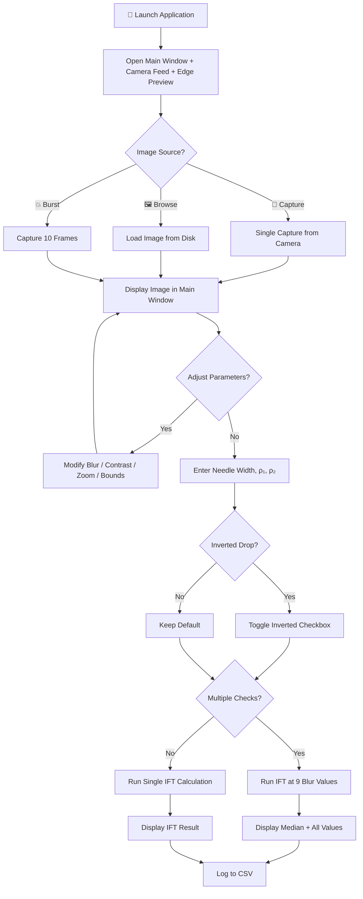
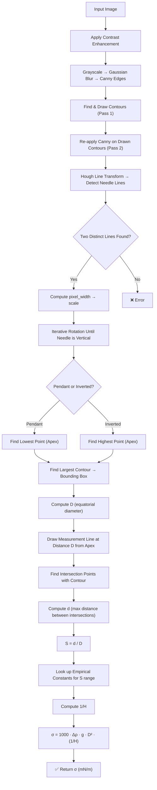
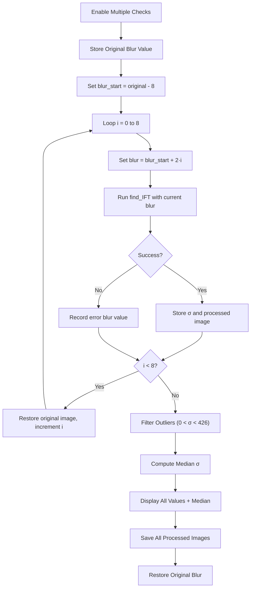

# 💧 Surface Tension Calculator GUI

A **PyQt5-based desktop application** for measuring **Interfacial / Surface Tension (IFT)** of pendant drops using real-time camera feeds or static images. The application implements the **Pendant Drop Method** combined with advanced image processing algorithms to automatically detect drop profiles, extract geometric parameters, and compute surface tension values.

> Developed as part of the **SRIC Research Internship, IIT Kharagpur**.

---

## 📑 Table of Contents

- [Overview](#overview)
- [Theory — Pendant Drop Method](#theory--pendant-drop-method)
- [Algorithm Pipeline](#algorithm-pipeline)
  - [1. Image Acquisition & Pre-processing](#1-image-acquisition--pre-processing)
  - [2. Edge Detection & Contour Extraction](#2-edge-detection--contour-extraction)
  - [3. Needle Detection via Hough Transform](#3-needle-detection-via-hough-transform)
  - [4. Automatic Image Rotation](#4-automatic-image-rotation)
  - [5. Drop Profile Analysis](#5-drop-profile-analysis)
  - [6. IFT Calculation using Empirical Correlations](#6-ift-calculation-using-empirical-correlations)
- [Features](#features)
- [Flowcharts](#flowcharts)
  - [Application Workflow](#application-workflow)
  - [IFT Calculation Pipeline](#ift-calculation-pipeline)
  - [Multiple Checks Mode](#multiple-checks-mode)
- [GUI Layout](#gui-layout)
- [Directory Structure](#directory-structure)
- [Installation](#installation)
- [Usage Guide](#usage-guide)
- [CSV Output Format](#csv-output-format)
- [Dependencies](#dependencies)

---

## Overview

This application provides a complete workflow for pendant drop tensiometry — from image capture to IFT value computation. It supports:

- **Live camera feed** with real-time edge detection preview
- **Image capture** (single & burst modes) and **file browsing**
- **Adjustable image processing parameters** (blur, contrast, zoom)
- **Automatic needle detection and image rotation** for alignment
- Support for both **pendant (hanging) and inverted (sessile/rising) drops**
- **Multiple blur-check mode** for statistical robustness
- **Automated CSV logging** of all computed results

---

## Theory — Pendant Drop Method

The Pendant Drop Method determines the surface/interfacial tension of a liquid by analyzing the shape of a drop hanging from a needle tip. The key principle:

> A pendant drop's shape is governed by the balance between **gravitational forces** (which elongate the drop) and **surface tension forces** (which resist deformation and try to minimize surface area).

### Key Geometric Parameters

| Parameter | Symbol | Description |
|-----------|--------|-------------|
| **Equatorial diameter** | `D` | Maximum horizontal width of the drop |
| **Selected diameter** | `d` | Horizontal width of the drop at a distance `D` above/below the apex |
| **Shape factor** | `S = d / D` | Ratio that characterizes the drop shape |

### IFT Formula

The interfacial tension (σ) is calculated as:

```
σ = Δρ · g · D² · (1/H)
```

Where:
- `Δρ = |ρ₁ − ρ₂|` — density difference between the two phases (kg/m³)
- `g = 9.81 m/s²` — gravitational acceleration
- `D` — equatorial diameter in meters (converted from pixels using needle width as scale)
- `1/H` — a correction factor derived from empirical correlations based on `S`

The result is reported in **mN/m** (multiplied by 1000).

### Empirical Constants

The correction factor `1/H` is computed using empirical polynomial correlations that depend on the range of `S`:

```
1/H = B₄ / S^A + B₃·S³ − B₂·S² + B₁·S − B₀
```

| S Range       | A       | B₄      | B₃      | B₂      | B₁      | B₀      |
|---------------|---------|---------|---------|---------|---------|---------|
| 0.401 – 0.46  | 2.56651 | 0.32720 | 0       | 0.97553 | 0.84059 | 0.18069 |
| 0.46 – 0.59   | 2.59725 | 0.31968 | 0       | 0.46898 | 0.50059 | 0.13261 |
| 0.59 – 0.68   | 2.62435 | 0.31522 | 0       | 0.11714 | 0.15756 | 0.05285 |
| 0.68 – 0.90   | 2.64267 | 0.31345 | 0       | 0.09155 | 0.14701 | 0.05877 |
| 0.90 – 1.00   | 2.84636 | 0.30715 | 0.69116 | 1.08315 | 0.18341 | 0.20970 |

---

## Algorithm Pipeline

### 1. Image Acquisition & Pre-processing

```
Input Image (camera capture / file browse)
       │
       ▼
┌─────────────────────────┐
│  Contrast Enhancement   │  (if contrast factor > 1)
│  ───────────────────     │
│  pixel' = α·(pixel − μ) │
│           + μ            │
│  α = contrast factor     │
│  μ = mean brightness     │
│  Clipped to [0, 255]     │
└─────────────────────────┘
       │
       ▼
  Grayscale Conversion
  (cv2.COLOR_BGR2GRAY)
       │
       ▼
  Gaussian Blur
  (kernel: blur_value × blur_value)
```

### 2. Edge Detection & Contour Extraction

The application employs a **two-pass edge detection** approach for robust contour extraction:

**Pass 1 — Initial Edge Detection:**
1. Apply **Canny edge detection** (thresholds: 30, 90) on the blurred grayscale image.
2. Find **external contours** using `cv2.findContours` with `RETR_EXTERNAL` mode.
3. Approximate contours with **polygonal curves** (`cv2.approxPolyDP`) using a very tight epsilon (0.000001 × arc length) to preserve drop shape.
4. Draw contours on a blank canvas.

**Pass 2 — Refined Edge Detection:**
1. Convert the drawn contours back to grayscale.
2. Apply minimal Gaussian blur (1×1 kernel).
3. Re-apply Canny edge detection to get cleaner, more consistent edges.

### 3. Needle Detection via Hough Transform

```
Refined Edges
     │
     ▼
┌────────────────────────────┐
│  Probabilistic Hough Lines │
│  ─────────────────────     │
│  Resolution  : 3 px       │
│  Angle Res   : π/180 rad  │
│  Threshold   : 50          │
│  MinLineLen  : 50 px      │
│  MaxLineGap  : 20 px      │
└────────────────────────────┘
     │
     ▼
┌─────────────────────────────┐
│  Select Two Distinct Lines  │
│  ──────────────────────     │
│  Criteria: x-coordinate    │
│  difference > 10 px        │
│  (ensures the two lines    │
│   are from opposite sides  │
│   of the needle)           │
└─────────────────────────────┘
     │
     ▼
  pixel_width = |x₁_line1 − x₁_line2|
  scale = needle_width_mm / pixel_width
```

### 4. Automatic Image Rotation

The application automatically rotates the image so that the **needle is perfectly vertical**, which is critical for accurate measurement:

1. Compute the angle of one detected needle line relative to horizontal.
2. Iteratively rotate the image in **1° steps** (up to 180°).
3. After each rotation, re-detect lines and re-check the angle.
4. Stop when the needle angle is within **±0.5°** of vertical (90°).
5. All three images (original, edges, color edges) are rotated in sync.

### 5. Drop Profile Analysis

**For Pendant (Hanging) Drops (`isInverted = False`):**
1. Find the **lowest point** (apex) of the drop contour.
2. Select the contour with the **largest bounding box area** as the drop contour.
3. Draw a bounding box and compute `D` (equatorial diameter) = bounding box width.
4. Draw a **horizontal measurement line** at distance `D` above the apex.
5. Find **intersection points** of this line with the drop contour.
6. Compute `d` as the maximum distance between intersection points.
7. Calculate `S = d / D`.

**For Inverted (Rising) Drops (`isInverted = True`):**
- Same algorithm, but the **topmost point** is used as the apex.
- The horizontal measurement line is drawn at distance `D` *below* the apex.

### 6. IFT Calculation using Empirical Correlations

```
S (shape factor)
     │
     ▼
┌──────────────────────────────┐
│  Look up empirical constants │
│  based on S range            │
│  → A, B₀, B₁, B₂, B₃, B₄   │
└──────────────────────────────┘
     │
     ▼
  1/H = B₄/S^A + B₃·S³ − B₂·S² + B₁·S − B₀
     │
     ▼
  σ = 1000 · |ρ₁ − ρ₂| · g · D² · (1/H)   [mN/m]
     │
     ▼
  Log to CSV  →  Display result in message box
```

---

## Features

### 🎥 Live Camera Feed
- Real-time camera feed with **live Canny edge detection** preview in a separate window.
- **Camera selection dropdown** — dynamically detects all connected cameras via `QCameraInfo`.
- Supports switching cameras on the fly.

### 📸 Image Capture
- **Single Capture** — captures a frame from the live camera feed. Saved with a timestamped filename to the `captures/` directory.
- **Burst Capture** — captures 10 consecutive frames (saved to `burst_captures/`).

### 🖼️ Image Browsing
- Browse and load images from disk (supports `.png`, `.jpg`, `.bmp`).
- Loaded images go through the same processing pipeline as captured frames.

### 🔧 Adjustable Processing Parameters

| Control | Range | Default | Description |
|---------|-------|---------|-------------|
| **Blur Slider** | 5 – 45 | 23 | Gaussian blur kernel size (auto-corrected to odd) |
| **Contrast Slider** | 1 – 10 | 1 | Contrast enhancement factor |
| **Zoom Slider** | 1× – 5× | 1× | Center-crop zoom on displayed image |
| **Lower/Upper Bound** | user input | −1 / 1 | Bounding box offset for fine-tuning drop detection |

### 🔄 Inverted Drop Support
- Toggle the **"Inverted Drop"** checkbox to switch between pendant (hanging) and inverted (rising/sessile) drop analysis.
- The algorithm adjusts the apex detection and measurement line placement accordingly.

### 📊 Multiple Checks Mode
- Toggle the **"Multiple Checks"** checkbox to enable this mode.
- Runs the IFT calculation **9 times** at different blur values (current ± 8, stepped by 2).
- Filters outlier values, computes the **median IFT**, and reports all individual values.
- Provides statistical robustness for noisy or ambiguous images.

### 🔁 Restore Defaults
- Resets the displayed image to the originally loaded/captured image, undoing any processing.

### 📁 Automatic Result Logging
- Every valid IFT computation (σ > 0 and σ < 500 mN/m) is automatically appended to `results/Results.csv`.
- Each row logs timestamp, medium names, densities, IFT, and geometric parameters.

### 🖥️ Multi-Window Architecture
- **Main Window** — image display and controls
- **Camera Feed Window** — live camera feed (640×480)
- **Edge Detection Window** — real-time Canny edge preview
- **Edit Image Window** — edge detection preview for static images

---

## Flowcharts

### Application Workflow



### IFT Calculation Pipeline



### Multiple Checks Mode



---

## GUI Layout

```
┌──────────────────────────────────────────────────────────────────┐
│                        Camera GUI (Main Window)                  │
├──────────────────────────────────────────┬───────────────────────┤
│                                          │  [Camera Dropdown  ▾] │
│                                          │  [Open Camera       ] │
│                                          │  [Capture Image     ] │
│                                          │  [Browse Image      ] │
│                                          │  [Restore Defaults  ] │
│                                          │  ☐ Inverted Drop      │
│          Captured / Browsed Image        │  ☐ Multiple Checks    │
│              (960 × 540)                 │  Blur:     ═══●═══ 23 │
│                                          │  Contrast: ●═══════ 1 │
│                                          │  Zoom:     ●═══════ 1×│
│                                          │  Lower [ __ ] Upper   │
│                                          │  ── Medium Names ──   │
│                                          │  Medium 1: [________] │
│                                          │  Medium 2: [________] │
│                                          │  ── Parameters ──     │
│                                          │  Needle Width: [____] │
│                                          │  ρ₁: [______________] │
│                                          │  ρ₂: [______________] │
│                                          │  [    Calculate     ] │
└──────────────────────────────────────────┴───────────────────────┘

┌─────────────────────┐  ┌─────────────────────┐
│  Live Camera Feed   │  │  Edge Detection      │
│    (640 × 480)      │  │  Preview (640 × 480) │
└─────────────────────┘  └─────────────────────┘
```

---

## Directory Structure

```
GUI_python/
├── main.py              # Main application source code
├── requirements.txt     # Python dependencies
├── README.md            # This file
├── captures/            # Saved camera captures (timestamped PNGs)
├── burst_captures/      # Saved burst capture sequences
├── processed/           # Processed drop images with annotations
├── results/             # CSV output directory
│   └── Results.csv      # Logged IFT computation results
└── dump/                # Miscellaneous / temporary files
```

---

## Installation

### Prerequisites
- **Python 3.7+**
- A connected USB or built-in camera (optional — you can also browse images)

### Steps

1. **Clone the repository:**
   ```bash
   git clone https://github.com/benab04/surface-tension-calculator-gui.git
   cd surface-tension-calculator-gui
   ```

2. **Install dependencies:**
   ```bash
   pip install -r requirements.txt
   ```

3. **Run the application:**
   ```bash
   python main.py
   ```

---

## Usage Guide

### Quick Start

1. **Launch** the application — the main window, camera feed, and edge detection preview will open.
2. **Capture or browse** an image of a pendant drop with its needle visible.
3. **Adjust parameters:**
   - Use the **Blur** slider to reduce noise while preserving edge detail.
   - Use the **Contrast** slider to enhance drop boundaries in low-contrast images.
   - Use the **Zoom** slider to inspect the drop closely.
   - Modify **Lower/Upper bounds** to fine-tune the bounding box if needed.
4. **Enter physical parameters:**
   - **Needle Width** (in mm) — the known outer diameter of the needle, used for pixel-to-metric scaling.
   - **ρ₁** and **ρ₂** — densities of the two phases (kg/m³).
   - Optionally enter **Medium 1** and **Medium 2** names for CSV labeling.
5. **Check "Inverted Drop"** if the drop rises upward (e.g., a bubble or lighter-phase drop).
6. **Click "Calculate"** to compute the IFT.
7. The result is displayed in a message box and logged to `results/Results.csv`.

### Tips for Best Results
- Ensure the **needle is clearly visible** and roughly vertical in the image.
- Adjust blur until the edge detection preview shows a **clean, continuous drop outline** without excessive noise.
- For noisy images, enable **"Multiple Checks"** to get a statistically robust median value.
- Use the **bounding box offset** fields (Lower/Upper) to exclude artifacts near the needle-drop junction.

---

## CSV Output Format

Results are automatically saved to `results/Results.csv` with the following columns:

| Column | Description |
|--------|-------------|
| `Timestamp` | Date and time of computation |
| `Medium 1` | Name of the first medium |
| `Density 1 (kg/m³)` | Density of medium 1 |
| `Medium 2` | Name of the second medium |
| `Density 2 (kg/m³)` | Density of medium 2 |
| `IFT (mN/m)` | Computed interfacial tension |
| `Temperature (K)` | Default: 298 K |
| `Pressure (bar)` | Default: 1 bar |
| `Salinity (g/L)` | Default: NaN |
| `Inverted Drop` | Boolean — whether inverted mode was used |
| `d` | Selected diameter in meters |
| `D` | Equatorial diameter in meters |
| `S` | Shape factor (d/D) |
| `InvH` | Correction factor (1/H) |

---

## Dependencies

| Package | Purpose |
|---------|---------|
| `PyQt5` | GUI framework (windows, widgets, camera integration) |
| `opencv-python` | Image processing (edge detection, contours, Hough transform) |
| `numpy` | Numerical computations and array operations |
| `imutils` | Convenient image rotation utilities |
| `Pillow` | Image format support |

---

## License

This project was developed as part of the **SRIC Research Internship** at **IIT Kharagpur**.

---

<p align="center">
  <em>Built with ❤️ using PyQt5 & OpenCV</em>
</p>
